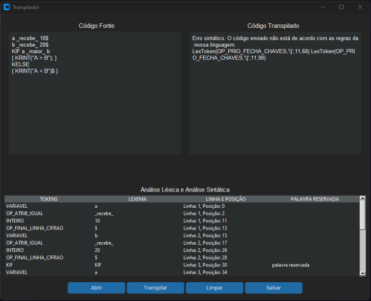

# A3_TCC_Kepler

## Introdução

No desenvolvimento de software, a tradução de código-fonte escrito em linguagens de alto nível para formas executáveis é uma etapa fundamental. Dois processos principais são usados para essa tradução: a compilação e a transpilação.

Um compilador é uma ferramenta que traduz código fonte de uma linguagem de programação de alto nível para código de máquina executável por um computador. Já os transpiladores traduzem código de uma linguagem de programação de alto nível para outra linguagem de programação de alto nível. O objetivo principal de um transpilador é permitir que o código fonte escrito em uma linguagem seja convertido para outra, mantendo o mesmo nível de abstração e legibilidade.

Os processos comuns aos compiladores e transpiladores são:

1. Análise Léxica: Divide o código em tokens.
2. Análise Sintática: Organiza tokens em uma árvore sintática, verificando a estrutura gramatical.
3. Análise Semântica: Assegura a validade semântica do código.

Para concluir a compilação é necessário os seguintes passos: 

4. Otimização: Melhora a eficiência do código intermediário.
5. Geração de Código: Transforma o código intermediário em código de máquina.
6. Montagem e Linkagem: Converte o código de máquina em binário e liga a bibliotecas necessárias.

Enquanto para concluir a transpilação é preciso: 

4. Transformação de Código: Transforma a árvore de sintaxe abstrata para refletir as construções da linguagem alvo.
5. Geração de Código: O código transformado é gerado na linguagem de destino.

Compiladores também podem incluir ferramentas de depuração e análise estática de código. A construção de compiladores é uma área complexa que envolve teoria de linguagens, algoritmos, arquitetura de computadores e otimização de software.

## O que é o trabalho?

O projeto consiste em criar um transpilador da linguagem Kepler para a linguagem Python. Ele aceita que você escreva o código ou submeta um arquivo com o código na linguagem desenvolvida e como saída mostra o código equivalente em Python e dá a opção de gerar um arquivo nesse linguagem.

## Como rodar esse projeto?

### Pré-requisitos
Existem alguns pré-requisitos para rodar esse projeto: 
  1. É preciso ter o python instalado, para instalar o python conforme seu sistema operacional acesse: [Python Download](https://www.python.org/downloads/)
  2. Também é preciso instalar as bibliotecas: [Ply](https://pypi.org/project/ply/), [Custom Tkinter](https://pypi.org/project/customtkinter/0.3/), [Tkinter]()

Após todas as dependências terem sidos corretamente instaladas você deverá rodar o script: 

```
python main.py
```

### Interface

Para melhor visualização do código e da transpilação foi criada uma interface com o customtkinter.


1. Botão "Abrir": Permite que carregue um arquivo txt com o código em linguagem kepler.
2. Botão "Transpilar": Ao clicar nesse botão o código na linguagem kepler é transpilado para linguagem python.
3. Botão "Limpar": Limpa as coluna "Código Fonte" e "Código Transpilado".
4. Botão "Salvar": Salva um arquivo com o código equivalente transpilado em python.

## Linguagem Kepler

| TOKENS |  LEXEMAS | EXP REGULAR | DESCRIÇÃO
| -----  | -------- | ----------- | ---------
| KIF | KIF | KIF | Palavra reservada KIF
| KELSE | KELSE | KELSE | Palavra reservada KELSE
| KWHILE | KWHILE | KWHILE | Palavra reservada KWHILE
| KOR | KOR | KOR | Palavra reservada KOR
| KRINT | KRINT | KRINT | Palavra reservada KRINT
| KINPUT | KINPUT | KINPUT | Palavra reservada KINPUT
| KRANGE | KRANGE | KRANGE | Palavra reservada KRANGE
| KIN | KIN | KIN | Palavra reservada KIN
| KT | KT | KT | Palavra reservada KT
| KF | KF | KF | Palavra reservada KF
| INTEIRO | 0,1,2,3,4,5,6,7,8,9 | `\d+` | Digito numérico inteiro
| DOUBLE | 0,009...9,999 | `([0-9]+\.[0-9]+)\|([0-9]+\.[0-9]+)` | Digito numérico reais
| STRING | a,b,c...x,y,z | `("[^"]*")` | Caracteres
| INT | INT | `INT` | 
| VARIAVEL | char(string,inteiro, double)* | `[a-z][a-z_0-9]*` | Declaração de variavel 
| BOOLEANO | (KT\|KF) | `KT\|KF` | Operador booleano
| OP_MAT_ADICAO | \_mais\_ | \_mais\_ | Operador matemático mais
| OP_MAT_SUB | \_menos\_ | \_menos\_ | Operador matemático menos
| OP_MAT_MULT | \_vezes\_| \_vezes\_ | Operador matemático multiplicação
| OP_MAT_POT | \_elevado\_ | \_elevado\_ | Operador matemático potencição
| OP_MAT_DIV | \_dividido\_ | \_dividido\_ | Operador matemático divisão
| OP_EXEC_VIRGULA | , | , | Operador virgula
| OP_ATRIB_IGUAL | \_recebe\_ | \_recebe\_ | Operador atribuição igual 
| OP_ATRIB_MAIS_IGUAL | \_mais\_igual\_ | \_mais\_igual\_ | Operador atribuição mais igual (adicionar)
| OP_REL_DUPLO_IGUAL | \_igual\_ | \_igual\_ | Operador relacional duplo igual (comparar se é igual)
| OP_REL_MENOR | \_menor\_ | \_menor\_ | Operador relacional menor
| OP_REL_MAIOR | \_maior\_ | \_maior\_ | Operador relacional maior
| OP_FINAL_LINHA_CIFRAO | $ | $ | Operador cifrão para indicar final de linha
| OP_PRIO_ABRE_PARENTESES | ( | ( | Operador de prioridades abre parenteses
| OP_PRIO_FECHA_PARENTESES | ) | ) |  Operador de prioridades fecha parenteses
| OP_PRIO_ABRE_CHAVES | { | { | Operador de prioridades abre chaves
| OP_PRIO_FECHA_CHAVES | } | } | Operador de prioridades fecha chaves


## Explicação do codigo

```python
import ply.lex as lex
from ply import yacc
import customtkinter as ctk
from tkinter import *
from tkinter import ttk
from tkinter import filedialog

```
Importações: Importa as bibliotecas necessárias. ply é usada para análise léxica e sintática. Enquanto customtkinter, tkinter, ttk, e filedialog são usadas para criar a interface gráfica.

#### Análise Léxica

```python
reserved = {
   'KIF'    : 'KIF',
   'KELSE'  : 'KELSE',
   'KWHILE' : 'KWHILE',
   'KOR'    : 'KOR',
   'KRINT'  : 'KRINT',
   'KINPUT' : 'KINPUT',
   'KRANGE' : 'KRANGE',
   'KIN'    : 'KIN',
   'KT'     : 'KT',
   'KF'     : 'KF',
}
```
Palavras reservadas: Define as palavras-chave da linguagem customizada. Esses identificadores não podem ser utilizados para nomear variáveis, funções ou outros elementos definidos pelo usuário, pois são reservados pelo compilador para a sintaxe e semântica da linguagem.

```python
tokens = [
    'INTEIRO',
    'DOUBLE',
    'STRING',
    'INT',
    'VARIAVEL',
    'BOOLEANO',
    'OP_MAT_ADICAO',
    'OP_MAT_SUB',
    'OP_MAT_MULT',
    'OP_MAT_POT',
    'OP_MAT_DIV',
    'OP_EXEC_VIRGULA',
    'OP_ATRIB_IGUAL',
    'OP_ATRIB_MAIS_IGUAL',
    'OP_REL_DUPLO_IGUAL',
    'OP_REL_MENOR',
    'OP_REL_MAIOR',
    'OP_FINAL_LINHA_CIFRAO', 
    'OP_PRIO_ABRE_PARENTESES',
    'OP_PRIO_FECHA_PARENTESES',
    'OP_PRIO_ABRE_CHAVES',
    'OP_PRIO_FECHA_CHAVES',
] + list(reserved.values())
```
Tokens: Define os tokens que o lexer reconhecerá, incluindo operadores, delimitadores, e as palavras reservadas.

```python
# Regras de expressão regular (RegEx) para tokens simples
t_KWHILE = r'KWHILE'
t_KIF    = r'KIF'
t_KELSE  = r'KELSE'
t_KOR    = r'KOR'
t_KRINT  = r'KRINT'
t_KINPUT = r'KINPUT'
t_KIN    = r'KIN'
t_KRANGE = r'KRANGE'
t_KT     = r'KT'
t_KF     = r'KF'

t_OP_MAT_ADICAO            = r'\+'
t_OP_MAT_SUB               = r'-'
t_OP_MAT_MULT              = r'\*'
t_OP_MAT_POT               = r'\*\*'
t_OP_MAT_DIV               = r'/'
t_OP_FINAL_LINHA_CIFRAO    = r'\$'
t_OP_EXEC_VIRGULA          = r'\,'
t_OP_ATRIB_IGUAL           = r'\='
t_OP_ATRIB_MAIS_IGUAL      = r'\+\='
t_OP_REL_DUPLO_IGUAL       = r'\=\='
t_OP_REL_MENOR             = r'\<'
t_OP_REL_MAIOR             = r'\>'
t_OP_PRIO_ABRE_PARENTESES  = r'\('
t_OP_PRIO_FECHA_PARENTESES = r'\)'
t_OP_PRIO_ABRE_CHAVES      = r'\{'
t_OP_PRIO_FECHA_CHAVES     = r'\}'

t_ignore = ' \t'  # Ignora espaço e tabulação
```
Tokens Simples: Regras RegEx para identificar tokens simples diretamente.

```python
# Regras de expressão regular (RegEx) para tokens mais "complexos"
def t_STRING(t):
    r'("[^"]*")'
    return t

def t_DOUBLE(t):
    r'([0-9]+\.[0-9]+)|([0-9]+\.[0-9]+)'
    return t

def t_INTEIRO(t):
    r'\d+'
    t.value = int(t.value)
    return t

def t_VARIAVEL(t):
    r'[a-z][a-z_0-9]*'
    return t

def t_INT(t):
    r'INT'
    return t 

def t_BOOLEANO(t):
    r'KT|KF'
    return t
```
Tokens Complexos: Funções para identificar e tratar tokens mais complexos, como strings, números inteiros e decimais, variáveis, e booleanos.

```python
# Define uma regra para que seja possível rastrear o números de linha
def t_newline(t):
    r'\n+'
    t.lexer.lineno += len(t.value)
```
Rastreamento de Linhas: Atualiza o número de linha quando encontra uma nova linha.

```python
# Regra de tratamento de erros
erroslexicos = []
def t_error(t):
    erroslexicos.append(t)
    t.lexer.skip(1)
```
Tratamento de Erros Léxicos: Armazena tokens que causaram erros e os ignora.
Análise Sintática

```python
def p_declaracoes_single(p):
    '''
    declaracoes : declaracao
    '''
# Outras regras de produção omitidas para brevidade
```
Regras de Produção: Define as regras de produção para a gramática da linguagem customizada. Cada função define como certos padrões de tokens podem ser combinados para formar estruturas sintáticas válidas.

```python
# Define a precedência e associação dos operadores matemáticos
precedence = (
    ('left', 'OP_MAT_ADICAO', 'OP_MAT_SUB'),
    ('left', 'OP_MAT_MULT', 'OP_MAT_DIV','OP_MAT_POT'),
)
```
Precedência de Operadores: Define a precedência dos operadores matemáticos para a análise sintática.

```python
errossintaticos = []
def p_error(p):
    global errossintaticos
    errossintaticos.append(p)
    if p:
        print("ERRO SINTÁTICO: ", p)
        return
    else:
        print("ERRO SINTÁTICO: erro de sintaxe desconhecido")
        return
```
Tratamento de Erros Sintáticos: Armazena e exibe erros sintáticos encontrados durante a análise.

```python
parser = yacc.yacc()
```
Criar o Parser: Cria o parser usando as regras definidas.

```python
def transpilar_codigo(codigo):
    lexer.input(codigo)
    tokens = []
    for token in lexer:
        tokens.append(token)

    # Concatenar tokens em uma única string
    codigo_tokens = " ".join([str(token.value) for token in tokens])
    print("String de tokens:", codigo_tokens)

    # Parse do código
    try:
        ast = parser.parse(codigo_tokens)
        print("Sucesso ao gerar árvore de análise sintática.")

        # Análise semântica e transpilação do código
        codigo_transpilado = transpilar_para_python(codigo)

        # Exibir o código transpilado
        if len(errossintaticos) == 0:
            print("Código transpilado:")
            print(codigo_transpilado)

        return codigo_transpilado

    except Exception as e:
        print("Erro durante a transpilação:", e)
        return None
```
Transpilação do Código: Realiza a análise léxica, cria uma string de tokens, faz o parse e, se não houver erros, transpila o código para Python.

```python
def transpilar_para_python(codigo_fonte):
    # Remover o cifrão no final da linha e espaços em branco subsequentes
    codigo_fonte = codigo_fonte.replace('$', '').rstrip()
    # Substituir palavras-chave e corrigir formatação
    # Detalhes omitidos para brevidade
    return codigo_fonte  
```
Transpilar para Python: Transforma o código da linguagem customizada em código Python, ajustando a sintaxe e substituindo palavras-chave.
Interface Gráfica

```python
def abrir_arquivo():
    arquivo_path = filedialog.askopenfilename(filetypes=[("Arquivos de texto", "*.txt"), ("Todos os arquivos", "*.*")])
    if arquivo_path:
        with open(arquivo_path, 'r') as file:
            conteudo = file.read()
            entrada_textbox.insert(ctk.END, conteudo)
```
Abrir Arquivo: Função para abrir e ler um arquivo de texto, exibindo seu conteúdo na área de entrada.

```python
def salvar_arquivo():
    arquivo_path = filedialog.asksaveasfile(filetypes=[("Arquivos de texto", "*.py"), ("Todos os arquivos", "*.*")])
    arquivo_path.write(saida_textbox.get("1.0", ctk.END).strip())
```
Salvar Arquivo: Função para salvar o código transpilado em um arquivo.

```python
def transpilar_arquivo():
    codigo_fonte = entrada_textbox.get("1.0", ctk.END).strip()
    codigo_transpilado = transpilar_codigo(codigo_fonte)
    saida_textbox.delete("1.0", ctk.END)
    saida_textbox.insert(ctk.END, codigo_transpilado)
```
Transpilar Arquivo: Função para transpirar o código da área de entrada e exibir o resultado na área de saída.

```python
root = ctk.CTk()
root.geometry("800x600")
root.title("Compilador - Linguagem Customizada")

entrada_textbox = ctk.CTkTextbox(root)
entrada_textbox.pack(fill="both", expand=True)

saida_textbox = ctk.CTkTextbox(root)
saida_textbox.pack(fill="both", expand=True)

abrir_button = ctk.CTkButton(root, text="Abrir Arquivo", command=abrir_arquivo)
abrir_button.pack(side="left")

transpilar_button = ctk.CTkButton(root, text="Transpilar", command=transpilar_arquivo)
transpilar_button.pack(side="left")

salvar_button = ctk.CTkButton(root, text="Salvar Arquivo", command=salvar_arquivo)
salvar_button.pack(side="left")

root.mainloop()
```
Interface Principal: Cria a janela principal da interface gráfica com campos de entrada e saída de texto, e botões para abrir, transpirar, e salvar arquivos.


## Alguns exemplos

### Exemplo de sucesso
#### Entrada: 
```
a _recebe_ 10$
b _recebe_ 20$
KIF a _maior_ b
{ KRINT("A > B")$ }
KELSE
{ KRINT("A < B")$ }
```
#### Saída em Python:
```
a = 10
b = 20

if a > b: 
    print("A > B")
else: 
    print("A < B")
```


### Exemplo de erro
#### Entrada: 
```
a _recebe_ 10$
b _recebe_ 20$
KIF a _maior_ b
{ KRINT("A > B"); }
KELSE
{ KRINT("A < B")$ }
```
#### Saída:
```
O código não está de acordo com as regras da nossa linguagem,
```



## Participantes

| Nome                                   | RA          | 
|----------------------------------------|-------------|
| Gabriel Antonio Lopes de Castro        | 1272023100  |  
| Julio Correa De Sagebin Cahú Rodrigues | 1272415912  |  
| João Amaral Lantyer                    | 1271919682  | 
| Marina Fernandes Porto Leite           | 1272121593  | 
| Manoel Felipe Costa Almeida Fernandes  | 12720110473 | 
